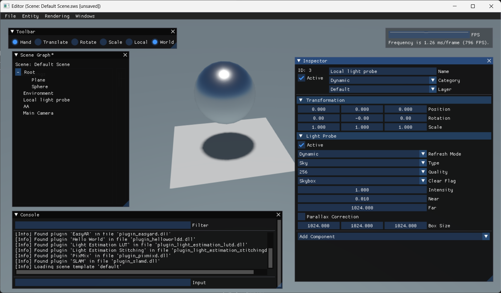
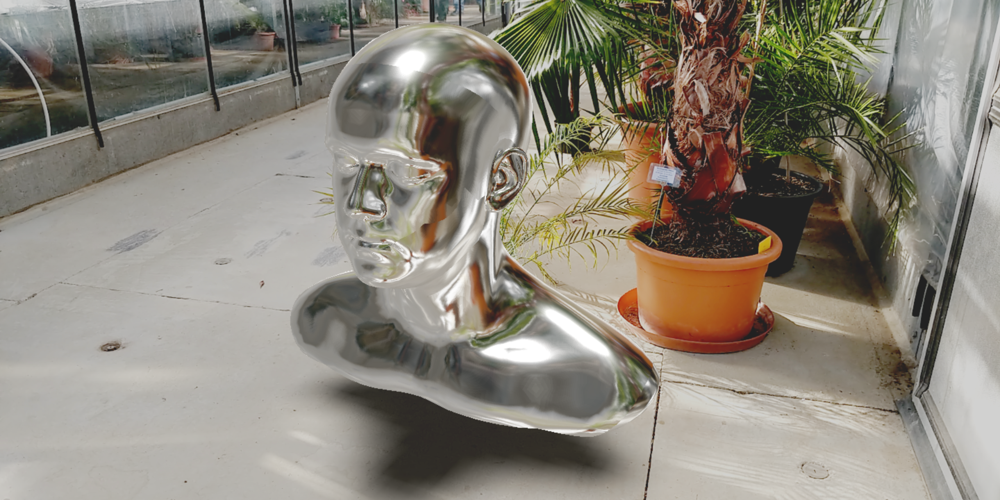
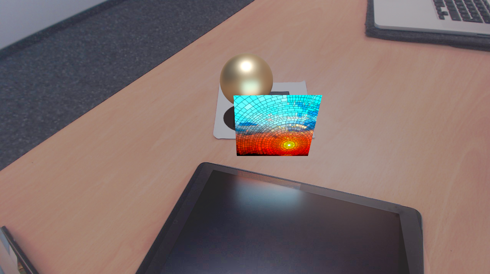
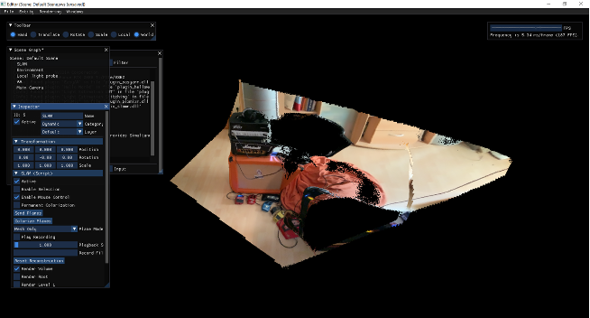
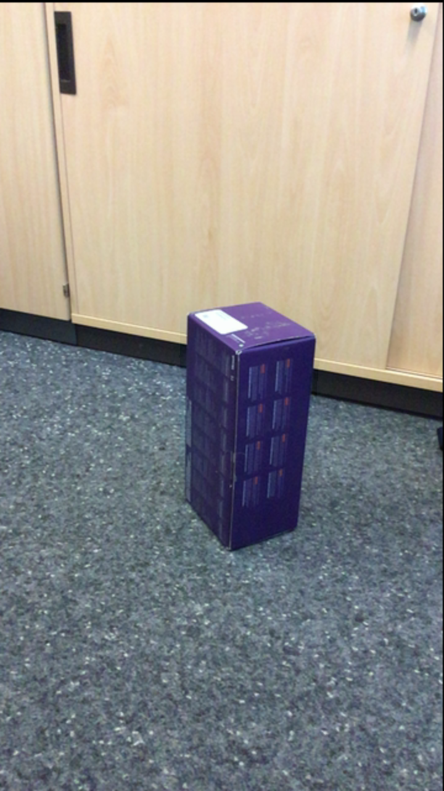
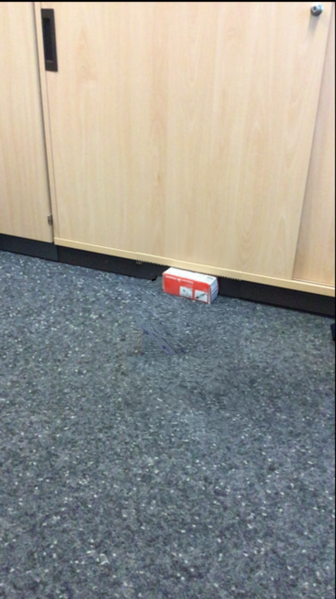
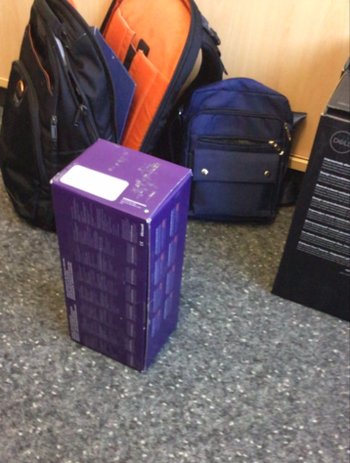
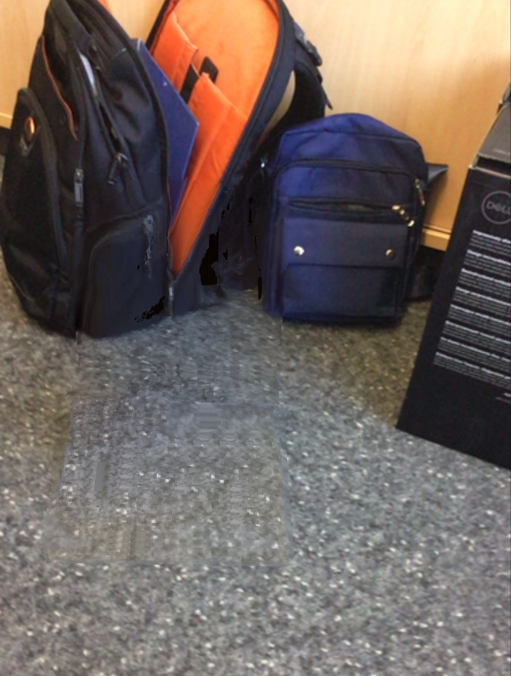

# Saltwater

**Saltwater** is a mixed and mediated reality graphics engine written in C++ that was developed at TU Ilmenau. It supports OpenGL 4.6 on desktop and OpenGL ES 3.2 on Android devices.

The engine includes a wide range of rendering techniques such as image-based lighting, physically based rendering, screen-space reflections, area lights, atmospheric scattering, caustics, shadow mapping, and global illumination using reflective shadow maps. The renderer is based on deferred shading and includes SMAA.

As the engine is built for mixed and mediated reality research, it allows for lighting interaction between the real world and virtual objects.

Additionally, the engine supports voxel-based reconstruction and diminished reality based on said reconstruction.

On Android, the engine uses ARCore tracking while on PC, it allows for marker tracking with webcams or ICP-based tracking.

The engine also includes a networking component, thereby enabling streaming and communication with server applications which allows for integrating further components such as inpainting and machine learning methods seamlessly.
To aid experimentation, the engine also includes config files, scenes, scene templates, and recording/replay features.

The engine was designed for experimentation in mixed and mediated reality rendering and as a way to realize our research ideas. 

Relevant publications: [1](https://ieeexplore.ieee.org/abstract/document/7781764), [2](https://link.springer.com/chapter/10.1007/978-3-319-60928-7_30), [3](https://ieeexplore.ieee.org/abstract/document/8590029), [4](https://ieeexplore.ieee.org/abstract/document/8613745), [5](https://ieeexplore.ieee.org/abstract/document/8919241), [6](https://link.springer.com/chapter/10.1007/978-3-662-61364-1_2), [7](https://link.springer.com/book/10.1007/978-3-658-35192-2), [8](https://ieeexplore.ieee.org/abstract/document/10337573)

---

## Main Features

- **Mixed and Mediated Reality Rendering**  
  Wide range of graphics effeects in a deferred shading engine and support for combining real and virtual content.

- **Reflection Probe Stitching**  
  Image-based stitching of reflection probes for improved lighting in mixed reality, including GANs for image inpainting.

- **Voxel-based Environment Reconstruction**  
  Real-time reconstruction of the environment with optional camera tracking.

- **Diminished Reality (DR)**  
  Removal of real-world objects using reconstructed geometry.

---

## Desktop Overview

### Main Window (Default Scene)

The default desktop scene showing the engine’s main view built with ImGui.

<p align="center">
  
</p>

---

## Reflection Probe Stitching

Examples of image stitching used for reflection probes to allow for realistic IBL in MR.

| Example 1 | Example 2 |
|------|------|
|  |  |

---

## Area Lights in Mixed Reality

Demonstration of area lights and lighting between real and virtual content.

<p align="center">
  
</p>

---

## Voxel-Based Reconstruction

The voxel-based reconstruction system used as a geometric representation of the real world.
The data was streamed from an iPad with a LiDAR sensor.

<p align="center">
  
</p>

---

## Diminished Reality

Examples of the diminished reality pipeline.  
The method uses the voxel-based reconstruction to remove real-world objects from 3D.
Unknown background information is synthesized.

### Examples

<table align="center">
  <tr>
    <th align="center">Input</th>
    <th align="center">Result</th>
  </tr>
  <tr>
    <td align="center">
      
    </td>
    <td align="center">
      
    </td>
  </tr>
  <tr>
    <td align="center">
      
    </td>
    <td align="center">
      
    </td>
  </tr>
</table>


---

## Build Guide:
1. Clone respository  
2. Fetch large files with Git LFS  
2. Copy DLL files from external to bin folder  
3. Open Visual Studio project file  
4. Change project properties -> Debugging:
```
Command = "$(SolutionDir)..\..\..\bin\$(TargetFileName)"
```
```
Working Directory = "$(SolutionDir)..\..\..\bin\"
```
Last but not least: Build and Run  


## Android:
These commands are needed for pushing data to Android devices:  
```
adb push data/ /storage/emulated/0/Android/data/de.tuilmenau.saltwater/files
```
```
adb push assets/ /storage/emulated/0/Android/data/de.tuilmenau.saltwater/files
```
